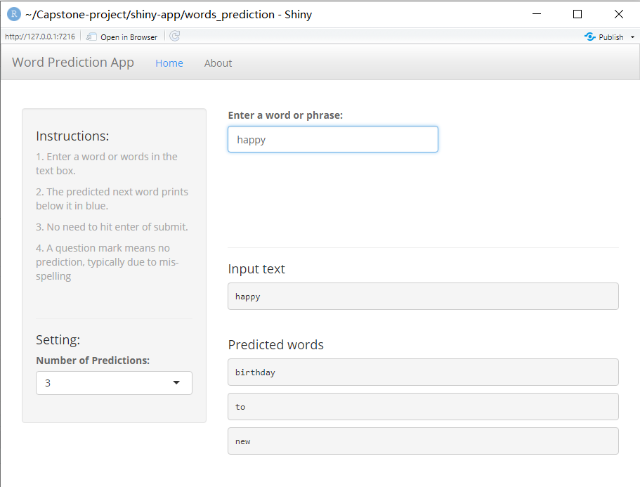

```{r setup, include=FALSE}
knitr::opts_chunk$set(echo = FALSE)
```

  
## Purpose of the Shiny app
  
Next Word Predict is a Shiny app that uses a text prediction algorithm to predict the next word(s) based on text entered by a user.

The application will suggest the next word in a sentence using an n-gram algorithm. An n-gram is a contiguous sequence of n words from a given sequence of text.

The text used to build the predictive text model came from a large corpus of blogs, news and twitter data. N-grams were extracted from the corpus and then used to build the predictive text model.

Various methods were explored to improve speed and accuracy using natural language processing and text mining techniques.

## User Interface

The predicted next word will be shown when the app detects that you have finished typing one or more words. When entering text, please allow a few seconds for the output to appear. Use the slider tool to select up to three next word predictions. The top prediction will be shown first followed by the second and third likely next words.
```{r, echo=FALSE,out.width = "600px"}
   
```

## Training Model - Dataset

The predictive text model was built from a sample of 800,000 lines extracted from the large corpus of blogs, news and twitter data.

The sample data was then tokenized and cleaned using the tm package and a number of regular expressions using the gsub function. As part of the cleaning process the data was converted to lowercase, removed all non-ascii characters, URLs, email addresses, Twitter handles, hash tags, ordinal numbers, profane words, punctuation and whitespace. The data was then split into tokens (n-grams).

## Training Model - Algorithm

As text is entered by the user, the algorithm iterates from longest n-gram (4-gram) to shortest (2-gram) to detect a match. The predicted next word is considered using the longest, most frequent matching n-gram. The algorithm makes use of a simple back-off strategy.


## Ready to give it a try?

Links:

Github repository:

*https://github.com/shorpenlee/Capstone-project*

Shinny application: 

*https://shaopengli.shinyapps.io/words_prediction/*
